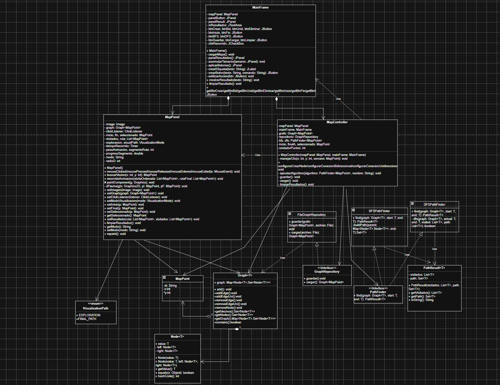
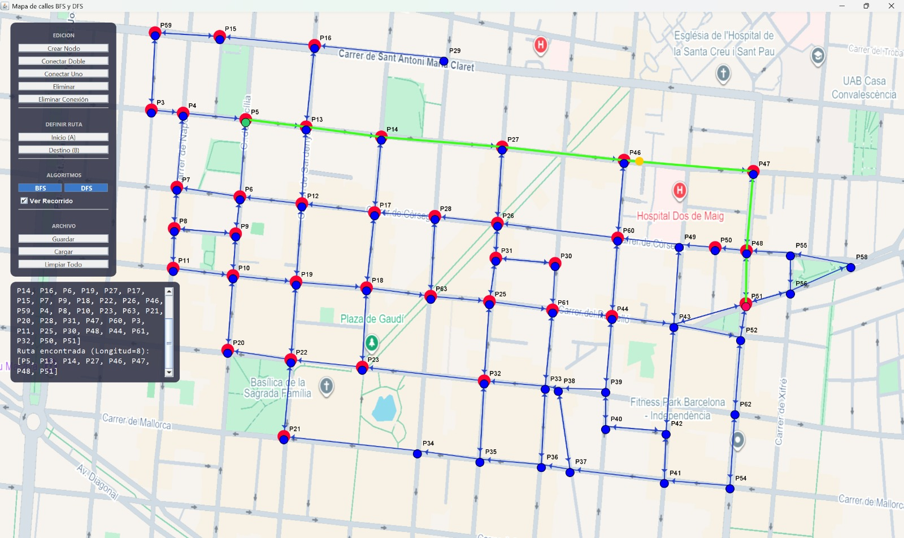
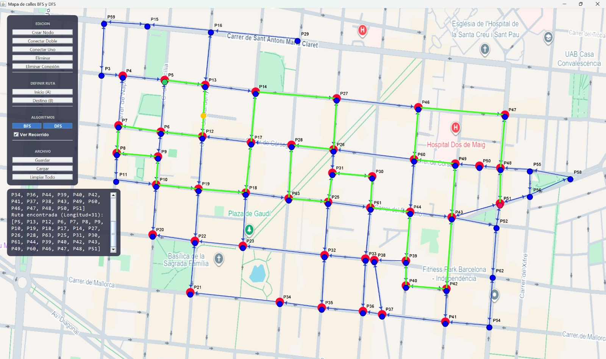
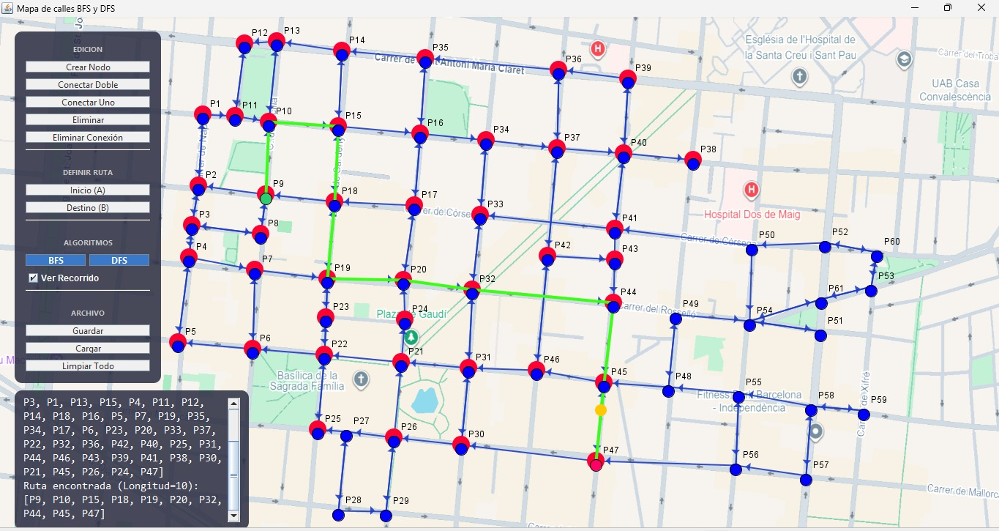

# Estructura de Datos

### Integrantes

- **Nombre:** Cristopher Carangui
- **Nombre:** Edwin Pintado
- **Nombre:** Richard Japón

### Correos Institucionales

- ccaranguic@est.ups.edu.ec
- epintador@est.ups.edu.ec
- rjaponl@est.ups.edu.ec

## Objetivo

Desarrollar una aplicación en Java que modele un mapa de calles mediante la estructura de datos de grafos, permitiendo representar
intersecciones como nodos y calles como aristas sobre una imagen de fondo, e implementar los algoritmos de búsqueda BFS y DFS para encontrar y 
visualizar rutas entre dos puntos, aplicando el patrón de arquitectura MVC y mecanismos de persistencia de información.

## Descripcion del problema

En el mundo actual la busqueda de rutas mediante aplicaciones como Google Maps es una tarea diaria que sin una buena implementacion o estructura
dentro de estas aplicaciones resultaria ineficiente o imposible de determinar un recorrido util entre dos puntos, en especial si existen muchos 
caminos o intersecciones con multiples direcciones.

El proyecto busca solucionar o plantear la solicion de este problema mediante la representacion de un mapa con calles y puntos donde cada punto 
corresponde a un nodo y cada calle un arista o conexión, usando estos puntos se implementan algoritmos de busqueda por anchura(BFS) o 
profundidad(DFS) permitiendo encontrar rutas entre los puntos que seleccione el usuario.

Este proyecto, además de calcular la ruta, permite visualizar el proceso de exploracion de cada algoritmo de busqueda, y anima el recorrido final encontrado para una mejor comprension, permitiendo comparar ambos algoritmos y a su vez permite guardar operaciones anteriores como
nodos y conexiones en archivos de texto para un uso posterior en caso de necesitarlo.

# Desarrollo

## Marco Teórico

### Grafos

Los grafos son una composición de conjuntos de objetos que denominamos nodos. En ellos se almacena diferentes tipos de elementos o
datos que podemos utilizar para procesar o conocer con fines específicos.
Adicionalmente estos nodos, suelen estar unidos o conectados a otros nodos a través de elementos que denominamos aristas.
Los nodos pertenecientes a un grafo pueden contener datos estructurada o no estructurada y al interrelacionarse con otros nodos producen 
relaciones interesantes que podemos analizar con diferentes finalidades.
Estos elementos son reconocidos por su capacidad de manejar altos volúmenes de datos y ser fácilmente procesados por motores de búsqueda o 
gestores de bases de datos orientados a grafos.

### BFS (Breadth-First Search)

La búsqueda en amplitud (BFS, por sus siglas en inglés) es un algoritmo de recorrido de grafos que comienza en un nodo de origen y explora el 
grafo nivel por nivel. Primero, visita todos los nodos directamente adyacentes al origen. Luego, continúa visitando los nodos adyacentes a 
estos, y este proceso se repite hasta que se hayan visitado todos los nodos alcanzables.

Como su nombre lo indica, BFS requiere que recorra el grafo en amplitud de la siguiente manera:

1. Primero, desplázate horizontalmente y visita todos los nodos de la capa actual.
2. Pasa a la siguiente capa.

### DFS (Depth First Search)

La búsqueda en profundidad (DFS) parte de un vértice de origen y explora un camino hasta la máxima profundidad posible. Al llegar a un vértice 
sin vecinos sin visitar, retrocede al vértice anterior para explorar otros caminos no visitados. Este proceso continúa hasta que se visitan 
todos los vértices accesibles desde el origen. 

- Ventajas:

La búsqueda en profundidad en un árbol binario generalmente requiere menos memoria que la búsqueda en amplitud.
La búsqueda en profundidad se puede implementar fácilmente con recursión.

- Desventajas

Una búsqueda en profundidad (DFS) no necesariamente encuentra el camino más corto a un nodo, mientras que una búsqueda en amplitud sí lo hace.

## Tecnologías utilizadas

**Instrumentos**
- Laptops
- GitHub
- Visual Studio Code
- Google
- Youtube

**Tecnologías**

- Java
- Java Swing
- Arquitectura MVC
- LinkedHashSet
- LinkedHashMap
- Queue
- LinkedList
- Stack
- Graphs
- BFS
- DFS
- Persistencia de datos (Archivos txt)

## Diagrama UML



## Arquitectua y estructura de carpetas

```text
ProyectoFinal-EST/
├── .vscode/
├── bin/
├── src/
│   ├── controllers/
│   │   └── MapController.java
│   ├── graphs/    
│   │   ├── Graph.java
│   │   ├── PathFinder.java
│   │   ├── PathResult.java
│   │   └── implementations/
│   │       ├── BFSPathFinder.java
│   │       └── DFSPathFinder.java 
│   ├── models/
│   │   ├── MapPoint.java
│   │   ├── VisualizationMode.java
│   │   └── node/
│   │       └── Node.java
│   ├── persistence/
│   │   ├── FileGraphRepository.java
│   │   └── GraphRepository.java
│   ├── resources/
│   │   ├── images/
│   │   │   └── upslogo.png
│   │   └── maps/
│   │       └── MapaBarcelona.png
│   ├── views/
│   │   ├── MainFrame.java
│   │   └── MapPanel.java
│   └── App.java
└── README.md
```

## Explicación general de funcionamiento

El proyecto simula un mapa de calles mediante grafos usando Java Swing, donde el usuario dibuja intersecciones y calles a mano sobre una imagen 
de fondo y selecciona un punto de partida y uno final, para luego buscar rutas usando BFS o DFS. 

El proyecto se estrcutura de la siguente manea, siguiendo la arquitectura Modelo-Vista-Controlador (MVC) que separa la logica interna de la interfaz gráfica y el control de eventos:

**Modelo**

Es el que contiene las clases que representan la informacion del mapa y la estructura de datos utilizada.

- node.Node : Es un parametro del grafo que encapsula datos genericos y es utilizado por la clase Graph para almacenar los elementos del mapa.

- `graphs.Graph<T>` : Un `Map<Node<T>`, `Set<Node<T>>>` (lista de adyacencia). Soporta aristas dirigidas (addEdgeUni) y
bidireccionales. Tambien permite operaciones como agregar y eliminar nodos,ademas de crear y consultar las conexiones entre los puntos del 
mapa.  

- models.MapPoint : un punto del mapa con id y coordenadas (x, y); es el tipo T que llena el grafo.

**Algoritmos de búsqueda**

La busqueda se implementa mediante una interfaz en la cual puede seleccionar dos algoritmos de busqueda diferentes.

- PathFinder<T> es una interfaz con un método find(Graph<T>, start, end).

- BFSPathFinder usa una cola para recorrer el grafo y un mapa de predecesores para reconstruir el camino encontrado.

- DFSPathFinder es recursivo, explora en profundidad y hace backtracking si un camino no llega al destino.

Ambos devuelven un PathResult con dos cosas: la lista de nodos visitados en orden (para animar la exploración) y el camino final encontrado.

**Persistencia**

Se implementa mediante la interfaz GraphRepository y su implementacion FileGraphRepository, se encarga de guardar y cargar un mapa desde un
archivo de texto, este archivo almacena los nodos y conexiones para cargar el grafo guardado una vez terminada la ejecucion del programa.

- FileGraphRepository guarda/carga el grafo en un archivo de texto plano con un formato simple: líneas NODE;id;x;y y EDGE;origen;destino;
bidireccional.

**Vista**

- MapPanel dibuja la imagen del mapa, los nodos, las flechas de conexión y anima la búsqueda con un javax.swing.Timer (pinta los nodos visitados uno a uno y luego "recorre" la ruta final con un punto naranja).

- MainFrame arma la ventana: el panel del mapa, el panel de botones (crear nodo, conectar, marcar inicio/fin, ejecutar BFS/DFS, guardar/cargar)
y el panel de resultados en texto.

**Controlador**

- MapController : Registra los listeners de todos los botones, decide en qué "modo" está el panel (crear, conectar, eliminar, 
marcar inicio/fin...) y, cuando el usuario hace clic sobre el mapa, interpreta ese clic según el modo activo. También dispara BFSPathFinder/
DFSPathFinder, mide el tiempo de ejecución con System.nanoTime(), y muestra el resultado.

## Configuraciones de diferentes mapas

BFS



DFS



## Ejemplo comentado y explicado



Busqueda Usada: BFS

Punto inicial: P9

Punto final: P47 

**Salida**

```text
Algoritmo: BFS

Tiempo: 0,242 ms

Visitados: 44

Orden visitados: [P9, P8, P2, P10, P3, P1, P13, P15, P4, P11, P12, P14, P18, P16, P5, P7, P19, P35, P34, P17, P6, P23, P20, P33, P37, P22, P32, P36, P42, P40, P25, P31, P44, P46, P43, P39, P41, P38, P30, P21, P45, P26, P24, P47]

Ruta encontrada (Longitud=10): [P9, P10, P15, P18, P19, P20, P32, P44, P45, P47]
```
Funcionamiento: Como utilizamos el algoritmo BFS, empezamos desde el punto P9(color verde), este algoritmo va a visitar todos los vecinos de P9

P9 entra a la cola y se marca como visitado. Es el único nodo del "nivel 0": BFS todavía no lo compara con el destino, solo lo registra.
Al sacar P9 de la cola, BFS revisa las calles que salen de él y encola a sus vecinos inmediatos, marcándolos como visitados y guardando a P9 
como su punto de partida para poder reconstruir el camino después.

El bucle se repite: saca el siguiente nodo de la cola, lo agrega a la lista de "visitados", y encola sus vecinos no visitados aún. Su 
comportamiento es como una onda la cual se expande de forma uniforme desde el origen, visitando cada nodo por niveles.

En algún momento P47 sale de la cola. La condición current.equals(end) se cumple de inmediato y el algoritmo se detiene, sin seguir 
vaciando el resto de la cola.

Usando recursividad dentro del mapa guardado en cada paso, BFS retrocede desde P47 hasta llegar a P9 (punto de partida), y luego invierte esa lista para obtener el camino en el orden correcto: de inicio a fin.

## Tabla comparativa


| Caso | Algoritmo | Inicio | Destino | Nodos visitados                       | Cantidad de aristas | Tiempo |
|------|-----------|--------|---------|---------------------------------------|--------------------|--------|
| 1    | BFS       | P5 | P40 | Orden visitados: [P5, P13, P12, P14, P16, P6, P19, P27, P17, P15, P7, P9, P18, P22, P26, P46, P59, P4, P8, P10, P23, P63, P21, P20, P28, P31, P47, P60, P3, P11, P25, P30, P48, P44, P61, P32, P50, P51, P39, P43, P33, P35, P49, P56, P52, P40] | 8 | 0,160 ms |
| 1    | DFS       | P5 | P40 | Orden visitados: [P5, P13, P12, P6, P7, P4, P8, P9, P10, P19, P18, P17, P14, P27, P26, P28, P63, P25, P31, P30, P61, P33, P32, P23, P22, P21, P20, P35, P34, P36, P44, P39, P40] | 22 | 0,079 ms |
| 2    | BFS       | P47 | P20 | Orden visitados: [P47, P48, P50, P51, P49, P43, P56, P52, P60, P42, P58, P62, P44, P46, P26, P40, P41, P55, P54, P39, P28, P27, P31, P37, P38, P17, P63, P25, P30, P36, P33, P14, P12, P18, P61, P32, P35, P6, P13, P19, P23, P34, P5, P7, P9, P16, P22, P21, P4, P8, P10, P15, P20] | 11 | 0,418 ms |
| 2    | DFS       | P47 | P20 | Orden visitados: [P47, P48, P50, P49, P43, P42, P40, P39, P38, P37, P36, P33, P32, P25, P31, P26, P28, P17, P14, P27, P46, P60, P44, P12, P6, P5, P13, P16, P15, P59, P3, P4, P7, P8, P9, P10, P19, P18, P23, P22, P21, P20] | 28 | 0,107 ms |
| 3    | BFS       | P3 | P62 | Orden visitados: [P3, P4, P59, P5, P15, P13, P12, P14, P16, P6, P19, P27, P17, P7, P9, P18, P22, P26, P46, P8, P10, P23, P63, P21, P20, P28, P31, P47, P60, P11, P25, P30, P48, P44, P61, P32, P50, P51, P39, P43, P33, P35, P49, P56, P52, P40, P38, P42, P36, P34, P58, P62] | 11 | 0,238 ms |
| 3    | DFS       | P3 | P62 | Orden visitados: [P3, P4, P5, P13, P12, P6, P7, P8, P9, P10, P19, P18, P17, P14, P27, P26, P28, P63, P25, P31, P30, P61, P33, P32, P23, P22, P21, P20, P35, P34, P36, P44, P39, P40, P42, P41, P37, P38, P43, P49, P60, P46, P47, P48, P50, P51, P56, P58, P55, P52, P62] | 34 | 0,154 ms |


¿Qué diferencias se observaron en el orden de exploración de BFS y DFS?

- El BFS busca la ruta de manera concéntrica o por niveles, es decir que comienza en el nodo inicio y va recorriendo por niveles visitando a todos los nodos vecinos. 

- DFS busca el la ruta siguiendo un solo camino hasta llegar a su final o el destino deseado, si no lo encuetra usa backtracking (retroceso) para tomar otra ruta. 

¿BFS encontró una ruta con menor cantidad de aristas en todos los casos evaluados?

- Si, en todos los casos BFS obtuvo la ruta mas corta por su forma de explorar por niveles. 

¿DFS encontró rutas diferentes a las obtenidas con BFS?

Si, ya que BFS busca el camino con menor nivel mientras que DFS profundiza cada camino y se guia por la prioridad de inserción en su pila de exploracion, generalmente menos óptimo. 

¿Qué algoritmo visitó más nodos en cada caso?

En los tres casos BFS visito a mas nodos antes de llegar al destino.

¿Los tiempos de ejecución fueron suficientes para determinar cuál algoritmo es mejor?

No, principalmente porque los tiempos solo varian por milisegundos, ademas para saber cual es mejor se deben ver mas aspectos como el objetivo de la busqueda, o el tamaño de la ruta esperada. 

¿Cómo influyó la estructura del grafo en el comportamiento de cada algoritmo?

Su influencia radico en como estan unidos los nodos, pues esto determino como los algoritmos exploran el mapa y la longitud de sus rutas. 

¿Qué ventajas aporta separar la lógica del algoritmo de la visualización?

Principalmente que al cambiar la interfaz o vista del algoritmo no nesesariamente debe afectar a la logica del programa, es decir son independientes pero trabajan en conjunto. 

¿Qué mejoras podrían implementarse para trabajar con calles ponderadas?

Se podrian implementar un peso a cada coneccion, nodo o calle visitada, ademas de medir la distancia o el tiempo. Ademas de modificar nuestros algoristos para que funciones con pesos o ponderaciones, o buscar otros algoritmos que funcionen con ponderacion para encontrar la ruta con menor costo. 

## Conclusiones

- Edwin Pintado 

- El análisis de los algoritmos muestra que ambos tienen diferencias entre ambas estrategias de búsqueda, pues BFS explora el grafo nivel por nivel para asegurar la ruta óptima pero se demora mas es por eso que no se puede asegurar un mejor metodo sin antes tener un objetivo claro.

- Por este motivo, BFS puede considerarse la mejor opción para encontrar soluciones óptimas, con la desventaja de que por su metodo de busqueda suele demorar mas, es decir que su coste es mayor.

- En conclucion cada uno tiene sus pros y contras y el mejor va a depender exclusiamente del objetivo se que tenga. 
- Cristopher Carangui
Para concluir el  análisis de pruebas nos indica la diferencia práctica que existe entre los dos algoritmos.BFS permite siempre hallar el camino corto o camino óptimo.Se verifica con las pruebas en diferentes puntos  de las longitudes de los caminos de BFS, que fueron contemplados en el proceso.Pero, la efectividad de BFS hace que implique un tiempo superior y una mayor exploración de nodos.Por el contrario, DFS es más veloz, pues se profundiza rápidamente.DFS logró obtener tiempos menores a BFS, explorando menos nodos para llegar a destino.En cambio DFS es que ofrece caminos mucho más largos .
Es así que se debería elegir BFS si se prioriza el sistema para que sea eficiente en el camino.Por el contrario, se tendrá que elegir por DFS si se intenta conseguir cualquier solución rápida independientemente de su calidad.La elección se basa en el tipo de balance que se quiera conseguir entre el costo de velocidad y la mejor calidad.

Richard Japón : 

Durante el desarrollo del proyecto se usaron y probaron los algoritmos de búsqueda BFS y DFS. Se comprobó que ambos funcionan bien. Sin embargo, su rendimiento depende del escenario en el que se usan. Se observó cómo cambian el tiempo de ejecución y el recorrido que hace cada algoritmo. Esto muestra las diferencias entre una búsqueda por niveles y una búsqueda en profundidad.


## Recomendaciones

- Validar la configuración antes de construir el grafo.
- Evitar que los algoritmos modifiquen directamente los componentes de la interfaz.
- Utilizar identificadores únicos para todos los nodos.
- Controlar correctamente los visitados para evitar ciclos infinitos.
- Medir el algoritmo sin incluir animaciones ni operaciones de dibujo.
- Probar el sistema con grafos conectados, desconectados y con ciclos.
- Refactorizar clases extensas y eliminar responsabilidades duplicadas.
- Documentar las decisiones de diseño y las limitaciones de la solución.
- Verificar el JAR en otro computador antes de realizar la entrega final.

## Fuentes

- https://www.grapheverywhere.com/grafos-que-son-tipos-orden-y-herramientas-de-visualizacion/
- https://www.geeksforgeeks.org/dsa/breadth-first-search-or-bfs-for-a-graph/
- https://www.hackerearth.com/practice/algorithms/graphs/breadth-first-search/tutorial/
- https://www.geeksforgeeks.org/dsa/depth-first-search-or-dfs-for-a-graph/
- https://www.interviewcake.com/concept/java/dfs